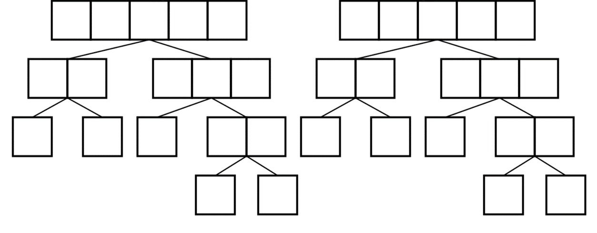

# Merge_sort_visualization
합병 정렬(Merge sort) 알고리즘 시각화

**구현 영상**

[](http://www.youtube.com/watch?v=XzlCobJIMF8)

## 0. 그대로 실행 시 주의사항
그대로 실행 시, 하위 디렉토리 ```\frames``` 를 생성하고 학습 내용에 대해 모두 저장하도록 되어 있습니다.
수많은 파일을 생성하고 싶지 않다면, ```Sort_visualization.cs``` 에서 ```Sort_visual```클래스의  ```save_frame()``` 함수를 수정하세요.

## 1. 합병 정렬(Merge sort)
**합병 정렬**

 합병 정렬(Merge sort)은 정렬 알고리즘 중 하나로, 분할 정복(divide and conquer) 알고리즘으로 정렬을 수행한다. 2개의 배열로 나누고 나누어진 두 배열로부터 합병(Merge)하는 과정을 재귀적으로 호출하여 전체가 정렬된 상태를 만드는 알고리즘

**시간 복잡도**

최선의 경우 : 


최악의 경우 : 


**의사코드**


## 2. 시각화 방법
**배열 원소 탐색 시각화**

 재귀 트리 형태로 표현



**배열 원소 수치 시각화**

 수치에 비례하게 원소의 색을 표현


